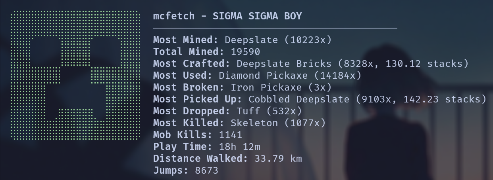

<h1 align="center">
  mcfetch
</h1>

<p align="center">
  <b>Neofetch for your Minecraft worlds</b>
</p>

<p align="center">
  <a href="../../releases/latest"></a>
  
  
  
</p>

<p align="center">
  A command-line tool that displays your Minecraft Java Edition player statistics in a neofetch-style format.
</p>

<p align="center">
  
</p>

---

## Stats Displayed

- **Blocks** &mdash; most mined, total mined
- **Items** &mdash; most crafted, most used, most broken, most picked up, most dropped
- **Combat** &mdash; most killed mob, total mob kills
- **Player** &mdash; play time, distance walked, deaths, jumps

## Usage

```sh
# Display stats (auto-selects the most recently played world)
mcfetch

# Pick which world to use
mcfetch config
```

`mcfetch config` opens an interactive prompt to select a Minecraft save. Your choice is stored in `~/.config/mcfetch/config.json` (Linux) or `%APPDATA%/mcfetch/config.json` (Windows) and used for all future runs.

## Installation

Minecraft Java Edition with at least one world that has been played in is required.

### Linux

1. Download the latest `mcfetch-linux` binary from [Releases](../../releases/latest)
2. Make it executable and move it to your PATH:

```sh
chmod +x mcfetch-linux
sudo mv mcfetch-linux /usr/local/bin/mcfetch
```

Minecraft saves are read from `~/.minecraft/saves`.

### Windows

1. Download the latest `mcfetch-windows.exe` from [Releases](../../releases/latest)
2. Place it somewhere in your `PATH`, or run it directly

Minecraft saves are read from `%APPDATA%\.minecraft\saves`.

### From source

Requires the [Rust toolchain](https://rustup.rs/) (1.85+).

```sh
git clone https://github.com/kacper-preyzner/mcfetch.git
cd mcfetch
cargo install --path .
```

## How It Works

1. Scans your Minecraft `saves` directory for worlds (validated by the presence of `level.dat`)
2. Reads the player statistics JSON file from `<world>/stats/<uuid>.json`
3. Parses all stat categories (mined, crafted, used, broken, picked up, dropped, killed, custom)
4. Renders the output alongside a Braille art creeper

## License

MIT
